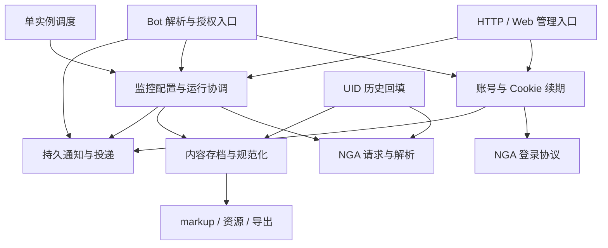

# Rust 服务端复杂度与精简评审

评审日期：2026-09-17。服务端基准：`7a9c9dd3c7fa0d33cdadcf6829f2c8f7d0ca0d63`，v0.1.4。

用户已明确：TID/UID 监控、通知、Bot、Cookie 续期、Web 管理页、导出及现有数据库能力都在使用；不需要多实例部署。本报告以保留这些功能为约束。Standalone 扩展不在范围内。

## 1. 判断

**值得做一次有明确边界的内部重构。最有价值的精简是让同一业务规则只有一个实现位置。现在没有足够理由从零重写整个服务或更换 Rust。**

当前服务承担持续监控、内容存档、通知投递、多轮登录交互和管理后台，规模确实超过“爬取一个帖子再写 Markdown”。这些需求解释了相当一部分代码，但不能解释同一登录终止流程由 API、Bot、session 和通知 worker 分头维护，或同一种 UID 回复详情被两个采集流程分别规范化。

主要问题有三类：

1. **业务规则的归属分散。** 模块名已经不少，调用方仍需了解状态列表、数据库字段和清理顺序。一个规则变更需要改几个地方。
2. **共享流程只收敛了一部分。** 运行开始有共同入口，结束仍分散；帖子保存被复用，NGA 回复规范化却没有一起复用。
3. **有小规模的预留框架和历史入口。** 固定命令的动态注册、未消费的类型/字段、旧采集入口和三个启动角色可以简化。但只删这些，很难显著改变维护体验。

单实例约束有用，但现有 HTTP、Bot、后台任务依然并发，进程也会重启。持久化手动请求、事务、去重和任务失效检查仍有实际用途。直接删除这些机制会降低当前功能的可靠性。

## 2. 代码规模：先分清实现、测试和产品范围

统计 `service/src/**/*.rs` 的物理行，包含注释和空行；将 `#[cfg(test)]` 测试模块及独立测试 helper 分开。不是语义复杂度度量，也不适合直接比较不同语言的生产率。排除 vendor、构建产物、fixture、文档及 HTML。

| Rust 范围 | 非测试行 | 测试行 |
| --- | ---: | ---: |
| Bot、续期会话、平台连接 | 4,709 | 1,016 |
| HTTP API | 3,572 | 341 |
| 采集、repository、调度、免拉取规则 | 4,921 | 1,817 |
| NGA 请求、解析、登录协议 | 1,769 | 628 |
| 通知匹配、投递、告警 | 1,599 | 812 |
| 资源、导出、markup | 1,786 | 573 |
| 启动、配置、加密、指标及其他 | 1,086 | 113 |
| **合计：64 个 Rust 文件** | **19,442** | **5,300** |

补充观察：

- Rust 总计 24,742 行，测试约占 21.4%。不能把测试全部计成生产实现负担。
- [export.rs](../src/export.rs) 的非测试实现约 575 行；[markup.rs](../src/markup.rs) 约 513 行；[assets.rs](../src/assets.rs) 约 698 行。Markdown 导出本身并非代码规模的主要来源。
- 两个数据库各有 7 个 migration，当前每个数据库有 29 张业务表。表数量反映了较宽的产品范围，不能据此认定每张表都应该合并。
- 约 262 处显式 `sqlx::query*` 调用分布在 26 个生产源码文件中，其中 repository 之外约 197 处。这个数字不是违规计数；它提示应重点检查哪些写入承载重复的业务规则。
- [admin.html](../src/api/admin.html) 只有 301 行，但有 93,241 字节，很多完整函数挤在一行。行数少并没有让它容易修改。拆分可读的 JS/CSS 文件可以改善维护，不必引入前端框架和构建工具链。

## 3. ngapost2md 对比

比较对象是 `neo` 分支当前读取到的提交 `e3b94346c805ac851ce2584e5ab4e3735846a3c9`，而非早期 Python 或 CLI 版本。该版本确实已有 WebUI、HTTP API、增量更新和 cron 定时任务。[项目说明](https://github.com/ludoux/ngapost2md/tree/e3b94346c805ac851ce2584e5ab4e3735846a3c9)

实际统计为 12 个 Go 文件、3,492 行 Go，加上 5 个 HTML 文件、733 行；这个快照中没有 `_test.go` 文件。核心 `nga/` 共 1,301 行，其中 `nga.go` 占 1,145 行。[核心实现](https://github.com/ludoux/ngapost2md/blob/e3b94346c805ac851ce2584e5ab4e3735846a3c9/nga/nga.go)

| 能力 | ngapost2md 当前实现 | 本服务 |
| --- | --- | --- |
| TID 存档、增量、Markdown、媒体 | 支持 | 支持，并保留可查询的帖子数据 |
| WebUI、定时执行 | 支持 | 支持，并区分手动来源、免拉取跳过和运行记录 |
| 作者筛选 | 指定 TID 内的 authorId 筛选 | 另有跨主题的 UID 主题/回复监控、独立水位及历史回填 |
| NGA 凭据 | 配置中填入 Cookie | 另有密码登录、确认、验证码、验证候选 Cookie 和恢复监控 |
| 通知与 Bot | 当前源码未实现本服务的对应流程 | Bark/飞书、入站授权、命令、多轮会话、重试和去重 |
| 状态持久化 | 帖子进度文件、资源映射、`schedules.json`；运行队列在内存 | 数据库事务、运行记录、游标、持久任务与 outbox |

对应证据：[配置](https://github.com/ludoux/ngapost2md/blob/e3b94346c805ac851ce2584e5ab4e3735846a3c9/config/config.go)、[任务队列](https://github.com/ludoux/ngapost2md/blob/e3b94346c805ac851ce2584e5ab4e3735846a3c9/server/task.go)、[调度](https://github.com/ludoux/ngapost2md/blob/e3b94346c805ac851ce2584e5ab4e3735846a3c9/server/schedule.go)。

值得借鉴的是它的用例入口直接：初始化一个帖子、下载、生成文件；单实例任务管理也很直观。应借鉴这种接口的清晰度。其文件状态模型不能直接替代本服务已经在使用的通知、审计和续期事务；把全部逻辑集中到类似 `nga.go` 的大文件，也不会自动降低认知成本。

在保留当前功能的约束下，没有证据支持“应当压缩到三四千行”这个目标。语言差异、测试数量和功能差异都需要分开计算。

## 4. Standards：结构与维护成本

以下以架构判断为主，不能仅凭代码味道当作功能错误。判断依据是当前调用关系和已经在使用的功能，不是预想中的多租户或平台扩展。

### S1. Cookie 续期应由一个账号模块拥有完整操作

证据：

- [api/account.rs](../src/api/account.rs) L496–515 和 [bot/commands/login.rs](../src/bot/commands/login.rs) L552–572 分别列举活动状态，再调用状态迁移和上下文清理。
- [bot/session.rs](../src/bot/session.rs) L362–400 暴露通用 `transition(from, to)`，要求调用方知道允许的来源状态及后续清理义务。
- [nga/login.rs](../src/nga/login.rs) L15 反向依赖 `bot::session` 中的协议类型。底层 NGA 协议因此依赖了交互入口所属模块。
- [notification/worker.rs](../src/notification/worker.rs) L285–345 从消息去重字符串提取会话 ID，并决定登录失败和上下文清理。

**方向：** 将续期操作放入账号模块，提供开始、确认、提交验证码、取消和过期处理等少量业务操作。把低层登录协议类型放回协议模块或账号模块。API/Bot 负责输入和展示；终态、清理、通知失效由同一个内部事务负责。先搬迁现有实现并删除旧路径，不另加一层仍然公开所有细节的包装。

### S2. 采集共享逻辑位于具体 collector 内，协调职责尚未收敛

[collector/user.rs](../src/collector/user.rs) 和 [collector/user_backfill.rs](../src/collector/user_backfill.rs) 使用 `collector::thread` 的凭据读取、主题 upsert 和帖子写入。`thread` 实际同时承担 TID 获取和通用存档写入。

另一方面，[repository/watch.rs](../src/repository/watch.rs) L799–890 已有共同的运行准备，但两个 collector 仍有旧 `run/create_crawl_run`、成功/失败/跳过收尾；HTTP [watch::run](../src/api/watch.rs) L485–545 和 [worker](../src/worker.rs) 又各自分发 collector。

**方向：** 共享“规范化后的内容保存”归内容存档模块；统一监控协调模块负责开始和完成运行。TID 和 UID 保留各自发现逻辑、水位和错误分类。历史回填保持独立进度和静默语义，只复用回复规范化及底层保存。当前旧入口需要连同其测试调用一起迁移并删除。

### S3. 双数据库支持有真实需求，方言和时间规则应集中

SQL 直接位于功能模块内并非天然问题；只读查询也不必全部套 repository。当前问题是时间格式、lease 时间表达、清空密文字段等跨数据库规则反复出现在账号、Bot、worker 和采集代码中。B2 已证明时间表示出现实际不一致。

**方向：** 保留 PostgreSQL/SQLite；集中少量数据库时间和写入规则。每类业务的完整写事务由该业务模块拥有；调用方不拼接时间表达式。无需为每张表建立 trait、实现类和泛型 CRUD 层。若统一时间表示需要改存量数据，必须同时设计两套数据库的迁移。

### S4. 投递 worker 了解了过多上游业务

[notification/worker.rs](../src/notification/worker.rs) 同时处理 Bot、系统告警、帖子通知，并负责平台构造、重试、凭据解密、登录图片后续指令和失败会话处理。L285–345 的登录策略尤其不应由通用投递循环解释。

**方向：** 保留三个队列的不同语义，先集中实际重复的发送结果和重试处理。由续期模块处理登录消息的后续业务动作，以明确的函数调用连接即可。暂不合并 outbox 表，也不建设通用工作流或事件总线。

### S5. 固定命令集使用了多余的动态注册和空壳

[commands/mod.rs](../src/bot/commands/mod.rs) L76–154 为五个固定 handler 使用 trait、`Arc` 和注册器；[help.rs](../src/bot/commands/help.rs) 还会重新构建路由。部分 handler 保存未使用的 `_state`；[bot/domain.rs](../src/bot/domain.rs) 的 `CommandResult` 和 `has_side_effects` 没有对应消费逻辑。

**方向：** 静态命令描述加普通函数足以保留现有命令、角色校验和私聊限制。清理确认无调用方的类型、字段和构造过程。Telegram/QQ 当前是预留，并无对应可运行 Bot adapter；其预留是设计选择，不应冒充当前用户在用的能力，也不是主要代码负担。

### S6. 单实例运行模型可以清楚很多，但不要承诺大幅减行

[main.rs](../src/main.rs) L39 起支持 `serve/worker/all`，分别维护启动和退出组合。整个文件只有 208 行；单靠收成一个 supervisor 不会消除数千行复杂度。

[worker.rs](../src/worker.rs) L35–138 依次等待资源、通知、回填和完整 crawl。对每类限制一次处理数量，无法限制一次全量采集的持续时间。因此长抓取期间，后台通知和过期清理仍然要等待。

**方向：** 收成单进程监督几个有限职责的异步循环，让投递/会话过期不受长采集阻塞；保持 NGA 请求的统一限速。先保留现有持久任务和失效 token，之后再评估哪些跨进程协议确实可以删除。不要为了分批而拆开必须原子提交的监控内容、水位和通知事务。

### S7. 类型和错误可以更直接，管理页可以更可读

[platform/integration.rs](../src/platform/integration.rs) L341 将业务冲突编码成 `sqlx::Error::Protocol` 字符串；[api/integration.rs](../src/api/integration.rs) L115 再用 `contains` 还原冲突。少量明确的业务错误类型可以去掉这层字符串约定。

[api/watch.rs](../src/api/watch.rs) L348–360 将多个历史、调度和通知参数展开传入 repository。按现有业务聚合的请求类型可以让调用方更容易理解；无需把所有 ID、字符串和配置都包装成新类型。

管理页应先格式化和按功能拆分资源，维持嵌入式发布方式。它的独立维护成本真实存在，但不是当前最值得重写的模块。

## 5. Spec：行为与契约核验

下列问题与前述架构判断分别列出。B1 为临时回归测试证实，B2 为确定性 SQLite SQL 复现，B3/B4 为静态核实的中断窗口，B5 为直接核对写入与响应契约，B6 为文档冲突。

### B1. 高优先级：UID 历史回填可能把回复存成主楼并丢失后续回复

实时 UID 采集的 [find_reply_detail](../src/collector/user.rs) L320–340 已处理 NGA 单 PID 详情返回 `lou=0` 的情况：验证 PID/作者后，修正为回复。历史回填 [user_backfill.rs](../src/collector/user_backfill.rs) L157–172 复制了查找逻辑却缺少这一步，L269–270 随后使用帖子类型决定自然键写入。

结果：同一 TID 的多个不同回复可能都被标成 `topic`，碰撞主楼唯一键；已有主楼时也可能不保存目标回复。违背[回填 Spec](UID_REPLY_HISTORY_BACKFILL_SPEC.md)的目标回复保存与自然键幂等要求。

已在隔离的服务副本做 parser → 回填候选选择 → 真实 `persist_page` → SQLite 查询复现。使用仓库合成 fixture，构造 TID 1001、UID 2002、PID 4001/4002，两条详情的 `lou` 均为 0：

```text
期望：[(4001, "reply"), (4002, "reply")]
实际：[(4001, "topic")]
```

这不是让通用 thread parser 把所有 `lou=0` 改成回复；真正的主楼也使用该值。应将“已知这是某个 PID 的回复详情”这一上下文及规范化一起复用。

### B2. 中优先级：SQLite 登录/消息 TTL 使用了不一致的时间表示

[session.rs](../src/bot/session.rs) L430–435 把 RFC3339 字符串直接写进 SQLite TEXT `expires_at`；L568 的清理和 [notification/worker.rs](../src/notification/worker.rs) L63/L80 却直接与 `CURRENT_TIMESTAMP` 比较。Bot 通知的 [outbox.rs](../src/bot/outbox.rs) L89–96/L120–122 也使用相同写法。

固定时间复现：

```sql
SELECT '2026-09-17T01:00:00Z' <= '2026-09-17 02:00:00';
-- 0：文本比较认为尚未过期
SELECT datetime('2026-09-17T01:00:00Z') <= datetime('2026-09-17 02:00:00');
-- 1：按时间比较已经过期
```

影响是会话清理和消息过期选择延后，同日已过期验证码图片仍可能进入发送。这里没有证明过期验证码能完成登录；登录协议上下文还有其他检查。应统一存取和比较规则，并处理已有混合格式数据，落实[续期设计](BOT_INTERACTION_AND_COOKIE_RENEWAL_DESIGN.md) L894–901 的 TTL/清理契约。

### B3. 中优先级：登录终态和敏感上下文清理不是原子操作

[session::transition](../src/bot/session.rs) L382–399 先单独提交终态，再调用 outbox 失效；[API 取消](../src/api/account.rs) L496–514 随后另行清空协议上下文。Bot 取消和过期路径类似。

如果进程在已提交终态后退出，L565–568 的过期清理只选择活动状态，不会继续修复这条终态记录。协议上下文密文可能长期残留；若中断发生在 outbox 失效前，待发图片仍可能被选择。

应把状态、协议上下文、相关 outbox 失效写入收成同一终止事务。数据库错误也不应让调用方得到半完成结果。此问题在单实例下同样存在。无需为了修它增加新的后台补偿系统。

### B4. 中优先级：采集失败的 watch 状态与 run 完成分两次提交

[thread.rs](../src/collector/thread.rs) L1235–1274 和 [user.rs](../src/collector/user.rs) L956–983 先提交 watch 状态/释放租约，再更新 `crawl_runs`。因鉴权失败或目标不存在而停用 watch 后，若第二次提交前中断，该 run 可一直保持 `running`。

调度的 [claim](../src/repository/watch.rs) L1127–1132 排除停用、paused 和 not_found 目标，无法依靠下一次自动领取修复这条记录；重新启用等外部操作才可能触发恢复。

应统一失败完成事务，将 run、watch、必要的暂停原因与恢复动作设计为明确的一次操作。这也落实了[免拉取设计](NO_FETCH_PERIODS_DESIGN.md) L115–125 所要求的共同运行协调职责。

### B5. 较低优先级：免拉取跳过运行缺少完成时间

[watch.rs](../src/repository/watch.rs) L748–757 插入终态 `skipped` 时没有写 `completed_at`，两个 schema 的该列均无默认值。[runs API](../src/api/watch.rs) L449–479 原样返回它，因此该类记录的完成时间始终为空。

免拉取设计要求“创建并完成”运行。修复可以很小；把所有运行完成归到共同入口后，也能避免同类遗漏。现有测试检查了跳过状态及零计数，却未覆盖完成时间。

### B6. 文档问题：通知过滤语义存在相互冲突的描述

[监控通知设计](MONITORING_NOTIFICATION_REDESIGN.md) L171/242 要求不命中作者过滤也记录事件来源；[当前根 README](../../README.md) L23 则明确未命中白名单不创建事件。当前代码和测试遵循后者。

核对提交历史，`ef08850`（2026-08-17，`Filter thread events by author UID allowlists`）明确更改了行为，并同步更新 README；旧设计未同步。**不能据旧设计把当前作者过滤实现判为 bug，更不能在重构中悄悄恢复旧行为。**

重构前应给已过期设计章节标记替代关系，保留简短的当前行为契约。文档数量较多而权威性不清，也会增加私人项目的维护成本。

## 6. 应当保留的复杂度与模块

| 内容 | 保留理由 | 可做的精简 |
| --- | --- | --- |
| NGA 错误分类、重试、fixture | 忙碌、待审核、未认证和空 503 的语义不同，影响水位 | 保留协议行为；集中回复详情的上下文规范化 |
| TID/UID 独立游标、静默基线 | 产品行为不同，合成一种游标会丢语义 | 共用协调和内容写入，各自保留发现算法 |
| UID 回填、楼层缺口补偿 | 已有明确需求和持久进度 | 共享合适的底层操作，不共享错误的高层策略 |
| 内容、游标、事件、outbox 事务 | 防止漏通知、错误推进水位和不完整基线 | 收敛事务所有权和调用面 |
| outbox、自然键、重试 | 私人服务也会遇到断网和重启 | 简化重复消费者代码；保留持久性和去重约束 |
| Cookie 加密、owner 私聊、候选验证 | 属于现有续期安全和正确性契约 | 账号模块统一封装 |
| markup、分页导出、临时 ZIP | 界面、通知和导出共享渲染；大主题不应全装内存 | 优先保留现有实现，小范围整理接口 |
| PostgreSQL/SQLite | 用户未要求删除数据库能力 | 集中方言，增加关键事务的双后端核验 |

`markup` 用一份解析供 HTML、Markdown、通知消费，`export` 对外隐藏分页和临时文件处理，都是已有价值的模块。资源维护、路径检查和共享文件引用也承担了真实的数据保护职责，应在现有结构上改进。

## 7. 建议的目标结构

继续使用一个 Rust crate、一个部署进程。先确定业务归属，再决定目录；以下图表示职责，不要求一次性搬完文件。



接口应以完整用例表达，例如账号模块的 `cancel_renewal`，而不是把 `transition`、`invalidate_outbox`、`clear_context` 三个步骤暴露给每个入口。监控模块应统一“准备运行”和“完成运行”，并允许成功内容事务继续原子包含水位、事件和 outbox。

HTTP 手动运行现在同步返回采集结果，Bot `/watch run` 则持久排队。这两个外部契约可以共用协调实现，但不能为了图好看直接把 HTTP 改成仅返回“已排队”。

## 8. 精简路线与验收标准

### 第一阶段：固定当前行为并处理已确认缺陷

- 修复 B1/B2；为回复保存和 TTL 加能够失败的回归核验。
- 整理作者过滤等冲突契约，以当前已接受行为为准。
- 在合并相应模块时修复 B3/B4 的事务所有权；B5 可随运行完成入口一起解决。
- 将涉及的协议测试、HTTP 契约和关键数据库事务作为后续重构护栏；双数据库至少核验时间、终态、去重这些跨后端风险较高的路径。

### 第二阶段：以 Cookie 续期作为第一条完整重构切片

- API、Bot、通知失败回调共用账号模块的完整操作。
- 收拢终态及清理规则；协议类型脱离 Bot。
- 删除旧的重复实现和未消费的命令框架元素。
- 验收：同一取消/过期规则只在一处；失败不写入候选 Cookie；用户主动暂停的 watch 不被恢复；相关回归通过。

这一切片既能消除重复，也能检验目标结构是否真的减少调用方知识。适合作为是否扩大重构范围的判断依据。

### 第三阶段：完成监控协调与内容保存的收敛

- 共用已验证的 UID 回复详情规范化。
- 共享内容写入移出 TID collector；收拢运行开始、成功、失败和跳过的 bookkeeping。
- 将仍调用旧创建入口的测试迁到共同协调入口，然后删除旧入口。
- 验收：TID/UID 规则仍各自清晰；历史回填不动实时游标、不产生事件；免拉取和手动运行行为保持；内容事务保持完整。

### 第四阶段：简化运行与投递编排，整理 UI

- 单实例 supervisor 统一退出处理；让通知和会话过期处理不等待长抓取。
- 收拢投递公共处理，保留不同队列的 TTL、去重键和业务语义。
- 拆分可读的管理页资源；维护嵌入式发布。
- 验收：长采集期间 Bot 消息可及时投递；原有 API 响应、命令、资源清理和导出行为保持。

第一轮尽量沿用数据库 schema，减少数据迁移风险。若确需修改时间字段或清理持久状态，使用两后端等价的新增 migration，并核验存量数据和回滚路径。

评价标准应是：一条规则有几个实现位置、一次变更需要跨几个模块、调用方是否必须知道清理顺序，以及旧实现是否已经删除。物理代码行数可以记录，但不应通过压行、删测试或牺牲行为来达标。当前证据不足以承诺可靠的减行百分比。

## 9. 精简与从零重写的选择

| 路线 | 对本项目的判断 |
| --- | --- |
| 只改命名、拆大文件 | 能改善阅读，无法解决重复状态机与事务归属 |
| 保留功能和存储，逐个重构业务模块 | **推荐**；每一步可核验、可回滚，并持续删除旧代码 |
| 同时重写采集、数据库、Bot、UI | 当前不建议；会同时重做已经积累的 NGA 边缘响应、续期协议和恢复语义 |
| 改语言以追求更少行数 | 当前没有证据表明语言是主要问题；同样的职责分散会在新语言里重现 |

如果第二阶段仍无法建立简单的账号接口，再比较该模块的局部替换方案。无需在验证一个重构切片之前承担整个服务重写和数据迁移的成本。

## 10. 核验与限制

本次覆盖了各主要模块的规模、依赖、关键用例、数据结构、设计文档、CI 和现有测试；深入检查了运行协调、UID 回填、Cookie 续期、通知、资源与导出路径。架构和性能判断基于源码，没有进行生产负载基准测试，也不声称穷尽所有运行时错误。

在原仓库执行：

```bash
cargo fmt --manifest-path service/Cargo.toml --all -- --check
cargo test --manifest-path service/Cargo.toml --locked --all-targets
cargo clippy --manifest-path service/Cargo.toml --locked --all-targets --all-features -- -D warnings
```

结果：fmt、Clippy 通过；测试 **146 passed、0 failed、1 ignored**。忽略项为显式要求真实 NGA 登录/验证码网络访问的手动测试，未执行。首次测试有一个本地 HTTP mock 因沙箱禁止监听 loopback 失败；允许本地监听后重跑通过。这不是服务实现失败。

额外核验：

- SQLite 内存数据库执行全部 7 个 migration，并确定性复现 B2 的时间比较差异。
- 隔离副本 `/tmp/nga-review-repro` 添加 B1 的单个回归测试，结果如预期失败，证明原实现存在漏帖。复现命令：

```bash
CARGO_TARGET_DIR=/root/project/NGAReminder/service/target \
cargo test --manifest-path /tmp/nga-review-repro/Cargo.toml \
  --offline --locked review_repro_backfill_preserves_two_lou_zero_replies \
  -- --nocapture
```

- 没有执行真实 NGA 请求、对外消息投递或 PostgreSQL 实例上的集成核验。现有测试及 CI 配置也不能替代 PostgreSQL 的运行验证。
- 原仓库生产代码、迁移和测试没有修改；新增内容仅为本报告。临时复现文件位于 `/tmp`，不会进入发布。
- 报告完成后执行 `git diff --check` 并检查本文全部相对链接。

Standards 共 7 组结构发现，最主要的是续期操作的业务归属分散；Spec 共 6 组发现，最严重的是已复现的 UID 回填漏帖，其中 B6 为文档冲突而非实现缺陷。
