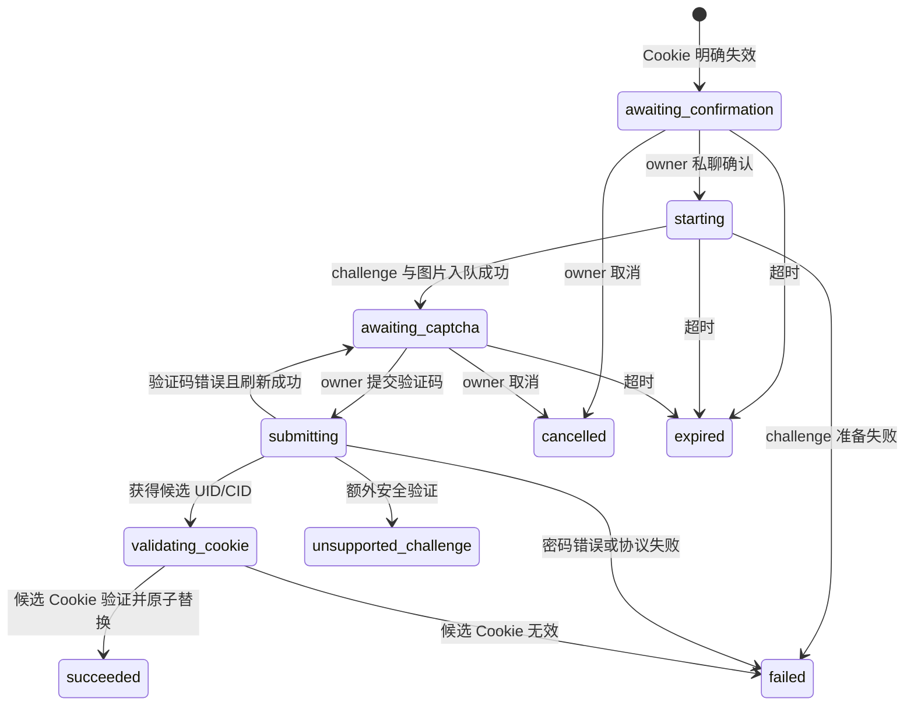

# 机器人交互与 NGA Cookie 续期设计

## 1. 目标与结论

本次设计增加通用机器人能力，并在飞书已有长连接基础上实现 `/指令` 交互。后续 Telegram、QQ 等平台通过适配器接入同一套命令、授权、会话和审计模型。

NGA 认证边界明确如下：

- 采集器始终使用 `ngaPassportUid` 和 `ngaPassportCid` 访问 NGA。
- 用户名和密码只是可选的 Cookie 续期凭据，不替代 Cookie，不参与日常采集请求。
- Cookie 失效后，服务先通知受信任用户；只有用户在机器人私聊中确认，服务才允许发起续期。
- 新 Cookie 必须通过现有连接测试后才能原子替换旧 Cookie。
- 无法处理的腾讯验证码、手机安全验证或 NGA 协议变化必须回退到管理台人工更新 Cookie，不能无限自动重试。

本次范围包括：

1. 抽象独立 `bot` 模块和平台适配器。
2. 将平台连接凭据、通知目标和机器人授权拆分建模。
3. 实现 `/指令` 命令路由、身份授权、消息幂等、会话和回复重试。
4. 将飞书长连接从“仅记录消息”改造成第一个机器人适配器。
5. 实现 Cookie 失效通知、用户确认、图形验证码交互和 Cookie 安全替换流程。
6. 对齐数据库、API、管理页面、运行状态、审计和测试。
7. 同一种平台在任意时刻最多只能有一个通知配置启用机器人能力。

不在本次范围内：

- 不使用密码代替 Cookie 进行主题或用户采集。
- 不允许用户在聊天消息中发送或修改 NGA 密码。
- 不实现自然语言意图识别，第一阶段只支持严格 `/指令`。
- 不在第一阶段通过机器人创建、修改或删除监控目标。
- 不尝试自动识别验证码，也不规避 NGA 的反自动化验证。

## 2. 当前实现与缺口

当前服务已经具备以下基础：

- 飞书企业应用使用 App ID/App Secret 发送通知。
- `notification::receiver` 使用飞书长连接订阅 `im.message.receive_v1`。
- 接收处理器可以解析消息 ID、聊天类型、聊天 ID、发送者 Open ID 和文本内容。
- 飞书配置变更后可以动态增删长连接，并具有指数退避重连。
- NGA Cookie 和通知平台密钥使用 `CredentialCipher` 加密保存。
- Cookie 失效会暂停账号和当前监控目标，并创建系统告警。
- 通知发送已有 outbox、租约、重试和投递审计。

当前缺口：

- 飞书接收器只记录日志，不分发命令、不回复用户。
- 入站文本会写入日志，不适合承载验证码等敏感交互。
- `FeishuConfig` 同时保存应用凭据和单个通知接收目标，无法自然表达“一个应用连接对应多个通知目标”。
- 所有启用的飞书通知渠道都会启动长连接，没有独立的机器人启用状态。
- 当前没有平台用户授权、私聊限制、事件去重或多轮会话。
- 当前 `watch_targets.enabled = 0` 无法区分用户主动暂停和 Cookie 失效暂停，登录恢复后不能安全自动恢复监控。
- 当前 `NgaClient` 是面向 Cookie API 请求的无状态客户端，没有登录专用 Cookie jar、验证码上下文和登录状态机。

因此，这不是简单增加一个消息回调的问题，需要同时调整通知平台模型、机器人运行时和认证暂停语义。

## 3. 设计原则

### 3.1 平台连接与通知目标分离

平台连接表示一组可以认证到平台的应用凭据，例如飞书 App ID/App Secret、Telegram Bot Token。通知目标表示该连接下的一个具体用户、群或频道。

同一个飞书应用只建立一条长连接，但可以拥有多个通知目标。机器人是否启用属于平台连接，不属于某个具体通知目标。

管理页面仍可在“通知渠道”配置流程中创建平台连接并勾选“启用机器人”，但服务端必须按两个实体保存。

同一种 `platform` 最多只能有一个平台连接设置 `bot_enabled = 1`。页面所称“某个通知渠道启用机器人”，实际表示该通知渠道背后的平台连接被选为该平台唯一的机器人连接；同一连接下的其他通知目标不会再创建机器人实例。即使该连接的总开关暂时关闭，机器人归属仍由它保留，必须显式切换或取消后才能选择同平台的另一个连接。

### 3.2 通知和机器人是独立能力

每个平台适配器声明自己的能力：

- `notification_send`
- `bot_receive`
- `bot_reply`
- `image_send`
- `interactive_card`

Bark 只支持通知发送；飞书、Telegram、QQ 可以同时支持通知和机器人。`delivery_enabled` 与 `bot_enabled` 分开控制，关闭通知发送不能隐式关闭机器人，反之亦然。

### 3.3 机器人只接收标准化事件

平台适配器负责把飞书、Telegram、QQ 的原始事件转换成统一 `BotEvent`。命令模块不得依赖飞书 Open ID、Telegram Update 等平台专有结构。

### 3.4 所有有副作用命令必须幂等和授权

平台可能重复推送同一消息。服务必须先用平台消息 ID 去重，再执行命令。`/watch run`、`/login confirm` 等有副作用命令不得仅依赖内存去重。

### 3.5 敏感登录交互仅允许受信任用户私聊

群聊可以查询只读状态，但登录确认、验证码和取消登录只允许已绑定的 `owner` 在 P2P 私聊执行。不能把“机器人所在群”或“通知接收目标”自动视为可信身份。

### 3.6 失败安全

- 新 Cookie 验证前保留旧 Cookie。
- 登录失败不覆盖账号，不自动恢复监控。
- 登录协议无法识别时停止流程并通知人工处理。
- 不自动连续尝试密码，防止触发账号锁定或风控。

## 4. 总体架构

```text
平台事件
  -> 平台 BotAdapter
  -> 有界入站队列
  -> 入站事件持久化/去重
  -> 身份与会话授权
  -> CommandRouter
  -> CommandHandler
  -> bot_outbox
  -> 平台 BotAdapter.reply/send

Cookie 失效
  -> 暂停全部受认证影响的 watch
  -> system_alert
  -> 创建 login_request
  -> bot_outbox 通知 owner
  -> /login confirm
  -> NgaLoginAdapter
  -> 验证码/安全验证会话
  -> /login captcha
  -> 获取候选 UID/CID
  -> check_credentials
  -> 原子替换 Cookie
  -> 恢复 pause_reason=auth 的 watch
```

模块依赖方向：

```text
bot::adapters -> bot::runtime -> bot::commands -> application services
notification::sender -------------------------> platform integrations
collector ------------------------------------> auth renewal trigger
nga::login -----------------------------------> NGA login protocol only
```

`bot` 模块可以调用监控、账号和查询 application service，但采集器、通知 worker 不得反向依赖某个平台适配器。

## 5. 代码模块设计

推荐目录：

```text
src/
  bot/
    mod.rs
    domain.rs
    adapter.rs
    runtime.rs
    dispatcher.rs
    repository.rs
    outbox.rs
    authorization.rs
    parser.rs
    session.rs
    commands/
      mod.rs
      help.rs
      status.rs
      watch.rs
      login.rs
      bind.rs
    adapters/
      mod.rs
      feishu.rs
      telegram.rs       # 后续
      qq.rs             # 后续
  platform/
    mod.rs
    integration.rs
    feishu.rs           # 飞书鉴权、公共 API client
  nga/
    login.rs
    mod.rs
  notification/
    sender.rs
    worker.rs
    alerts.rs
```

现有 `notification/receiver.rs` 的连接协调和飞书事件解析迁入 `bot/adapters/feishu.rs`。飞书 token provider、消息发送和图片上传等共用能力下沉到 `platform/feishu.rs`，避免通知 sender 与机器人 adapter 各维护一套鉴权逻辑。

### 5.1 标准化事件

```rust
pub struct BotEvent {
    pub integration_id: String,
    pub platform: BotPlatform,
    pub platform_event_id: Option<String>,
    pub platform_message_id: String,
    pub actor_id: String,
    pub actor_display_name: Option<String>,
    pub conversation_id: String,
    pub conversation_type: ConversationType,
    pub text: String,
    pub mentions: Vec<BotMention>,
    pub occurred_at: OffsetDateTime,
}

pub enum ConversationType {
    Private,
    Group,
    Channel,
}
```

`platform_message_id` 是命令幂等键。事件 ID 只用于排障，不作为飞书消息去重依据。

### 5.2 平台适配器

```rust
#[async_trait]
pub trait BotAdapter: Send + Sync {
    fn platform(&self) -> BotPlatform;
    fn capabilities(&self) -> PlatformCapabilities;

    async fn run(
        &self,
        sink: BotEventSink,
        cancellation: CancellationToken,
    ) -> Result<(), BotAdapterError>;

    async fn deliver(
        &self,
        message: &BotOutboundMessage,
    ) -> Result<BotDeliveryReceipt, BotSendError>;
}
```

`run` 负责连接、重连和原始事件转换；`deliver` 同时支持回复原消息和主动发送。平台 adapter 不解析业务命令。

### 5.3 命令处理器

```rust
#[async_trait]
pub trait BotCommandHandler: Send + Sync {
    fn descriptor(&self) -> CommandDescriptor;

    async fn handle(
        &self,
        context: CommandContext,
        arguments: &[String],
    ) -> Result<CommandResult, CommandError>;
}
```

`CommandDescriptor` 声明命令名称、别名、最低角色、是否仅限私聊、是否有副作用和帮助文本。授权由 dispatcher 在 handler 前统一完成。

## 6. 数据库设计

项目仍处于开发环境，实施时直接修改 PostgreSQL/SQLite 的合并版 `0001_initial_schema.sql` 并重建开发库，不保留旧通知渠道表结构兼容层。

### 6.1 平台连接

```sql
CREATE TABLE platform_integrations (
    id TEXT PRIMARY KEY,
    platform TEXT NOT NULL
        CHECK (platform IN ('bark', 'feishu', 'telegram', 'qq')),
    label TEXT NOT NULL UNIQUE,
    enabled INTEGER NOT NULL DEFAULT 1 CHECK (enabled IN (0, 1)),
    delivery_enabled INTEGER NOT NULL DEFAULT 1 CHECK (delivery_enabled IN (0, 1)),
    bot_enabled INTEGER NOT NULL DEFAULT 0 CHECK (bot_enabled IN (0, 1)),
    credentials_encrypted BYTEA NOT NULL,
    connection_status TEXT NOT NULL DEFAULT 'disconnected'
        CHECK (connection_status IN
            ('disconnected', 'connecting', 'connected', 'error')),
    last_connected_at TIMESTAMPTZ,
    last_error_kind TEXT,
    created_at TIMESTAMPTZ NOT NULL DEFAULT CURRENT_TIMESTAMP,
    updated_at TIMESTAMPTZ NOT NULL DEFAULT CURRENT_TIMESTAMP,
    CHECK (platform <> 'bark' OR bot_enabled = 0)
);

CREATE UNIQUE INDEX platform_integrations_one_bot_per_platform
    ON platform_integrations (platform)
    WHERE bot_enabled = 1;
```

SQLite 使用 `BLOB` 和 `TEXT` 时间类型，约束语义保持一致。

凭据示例：

```json
{
  "platform": "feishu",
  "credentials": {
    "app_id": "cli_...",
    "app_secret": "..."
  }
}
```

`credentials_encrypted` 不保存通知目标。列表 API 不返回密钥，只返回 `credentials_configured`。

`platform_integrations_one_bot_per_platform` 是最终约束，不能只依赖管理页面校验。PostgreSQL 和 SQLite 均使用相同的 partial unique index。切换机器人连接时必须在一个事务内先清除该平台原连接的 `bot_enabled`，再启用新连接，不能在两个独立 API 请求之间留下竞态窗口。

### 6.2 通知目标

重建 `notification_channels`：

```sql
CREATE TABLE notification_channels (
    id TEXT PRIMARY KEY,
    integration_id TEXT NOT NULL
        REFERENCES platform_integrations(id) ON DELETE RESTRICT,
    label TEXT NOT NULL UNIQUE,
    enabled INTEGER NOT NULL DEFAULT 1 CHECK (enabled IN (0, 1)),
    target_encrypted BYTEA NOT NULL,
    created_at TIMESTAMPTZ NOT NULL DEFAULT CURRENT_TIMESTAMP,
    updated_at TIMESTAMPTZ NOT NULL DEFAULT CURRENT_TIMESTAMP
);
```

飞书通知目标示例：

```json
{
  "receive_id_type": "chat_id",
  "receive_id": "oc_..."
}
```

现有 `watch_notification_channels`、通知 outbox 和系统告警 outbox 继续引用 `notification_channels.id`，监控与通知匹配语义不变。

### 6.3 机器人身份绑定

```sql
CREATE TABLE bot_bindings (
    id TEXT PRIMARY KEY,
    integration_id TEXT NOT NULL
        REFERENCES platform_integrations(id) ON DELETE CASCADE,
    actor_id TEXT NOT NULL,
    conversation_id TEXT,
    conversation_type TEXT
        CHECK (conversation_type IN ('private', 'group', 'channel')),
    role TEXT NOT NULL CHECK (role IN ('owner', 'operator', 'read_only')),
    label TEXT NOT NULL,
    enabled INTEGER NOT NULL DEFAULT 1 CHECK (enabled IN (0, 1)),
    created_at TIMESTAMPTZ NOT NULL DEFAULT CURRENT_TIMESTAMP,
    updated_at TIMESTAMPTZ NOT NULL DEFAULT CURRENT_TIMESTAMP,
    UNIQUE (integration_id, actor_id, conversation_id)
);
```

授权判断同时匹配 `integration_id + actor_id`。如果 binding 指定 `conversation_id`，则只在该会话中有效。登录命令必须额外满足 `role = owner` 和 `conversation_type = private`。

### 6.4 一次性绑定码

首次配置机器人时管理台并不知道用户的飞书 Open ID。使用一次性绑定码完成可信身份建立：

```sql
CREATE TABLE bot_pairing_tokens (
    id TEXT PRIMARY KEY,
    integration_id TEXT NOT NULL
        REFERENCES platform_integrations(id) ON DELETE CASCADE,
    token_hash TEXT NOT NULL UNIQUE,
    requested_role TEXT NOT NULL
        CHECK (requested_role IN ('owner', 'operator', 'read_only')),
    expires_at TIMESTAMPTZ NOT NULL,
    used_at TIMESTAMPTZ,
    created_at TIMESTAMPTZ NOT NULL DEFAULT CURRENT_TIMESTAMP
);
```

管理台只显示一次原始绑定码，数据库只保存 SHA-256/HMAC 后的值。用户在机器人私聊输入 `/bind <code>` 后，服务从事件中取得平台 actor ID 并创建 binding。绑定码默认 10 分钟过期且只能使用一次。

### 6.5 入站事件审计与幂等

```sql
CREATE TABLE bot_inbound_events (
    id TEXT PRIMARY KEY,
    integration_id TEXT NOT NULL
        REFERENCES platform_integrations(id) ON DELETE CASCADE,
    platform_message_id TEXT NOT NULL,
    platform_event_id TEXT,
    actor_id TEXT NOT NULL,
    conversation_id TEXT NOT NULL,
    conversation_type TEXT NOT NULL,
    command_name TEXT,
    status TEXT NOT NULL DEFAULT 'received'
        CHECK (status IN
            ('received', 'processing', 'succeeded', 'rejected', 'failed')),
    error_kind TEXT,
    received_at TIMESTAMPTZ NOT NULL DEFAULT CURRENT_TIMESTAMP,
    processed_at TIMESTAMPTZ,
    UNIQUE (integration_id, platform_message_id)
);
```

该表不保存原始消息正文和命令参数。解析和执行期间只在受控内存对象中保留正文；日志最多记录 `command_name`、事件 ID、actor ID 的哈希或脱敏值。

### 6.6 机器人回复 outbox

```sql
CREATE TABLE bot_outbox (
    id TEXT PRIMARY KEY,
    dedupe_key TEXT NOT NULL UNIQUE,
    integration_id TEXT NOT NULL
        REFERENCES platform_integrations(id) ON DELETE RESTRICT,
    inbound_event_id TEXT REFERENCES bot_inbound_events(id) ON DELETE SET NULL,
    conversation_id TEXT NOT NULL,
    reply_to_message_id TEXT,
    message_kind TEXT NOT NULL
        CHECK (message_kind IN ('text', 'image', 'card')),
    payload_encrypted BYTEA NOT NULL,
    status TEXT NOT NULL DEFAULT 'pending'
        CHECK (status IN ('pending', 'sending', 'delivered', 'failed', 'dead')),
    attempt_count INTEGER NOT NULL DEFAULT 0,
    next_attempt_at TIMESTAMPTZ NOT NULL DEFAULT CURRENT_TIMESTAMP,
    lease_until TIMESTAMPTZ,
    expires_at TIMESTAMPTZ,
    last_error_kind TEXT,
    delivered_at TIMESTAMPTZ,
    created_at TIMESTAMPTZ NOT NULL DEFAULT CURRENT_TIMESTAMP
);
```

`dedupe_key` 由业务来源稳定生成：命令回复使用 `command:{integration_id}:{platform_message_id}:{sequence}`，登录确认使用 `login:{session_id}:confirmation`，验证码使用 `login:{session_id}:captcha:{revision}`。普通命令回复最多重试 3 次。验证码图片和登录相关消息设置短 TTL；过期后直接标记 `dead` 并清除 payload，不发送已经失效的验证信息。

### 6.7 登录续期配置

保留 `nga_accounts.passport_uid_encrypted` 和 `passport_cid_encrypted`。续期凭据独立建表，并显式选择一个 owner 私聊 binding 作为登录通知和交互目标：

```sql
CREATE TABLE nga_account_renewal_settings (
    account_id UUID PRIMARY KEY REFERENCES nga_accounts(id) ON DELETE CASCADE,
    enabled INTEGER NOT NULL DEFAULT 1 CHECK (enabled IN (0, 1)),
    login_name_encrypted BYTEA NOT NULL,
    password_encrypted BYTEA NOT NULL,
    bot_binding_id TEXT NOT NULL REFERENCES bot_bindings(id) ON DELETE RESTRICT,
    credential_status TEXT NOT NULL DEFAULT 'ready'
        CHECK (credential_status IN ('ready', 'invalid', 'cooldown')),
    consecutive_failure_count INTEGER NOT NULL DEFAULT 0,
    cooldown_until TIMESTAMPTZ,
    last_renewal_at TIMESTAMPTZ,
    last_error_kind TEXT,
    created_at TIMESTAMPTZ NOT NULL DEFAULT CURRENT_TIMESTAMP,
    updated_at TIMESTAMPTZ NOT NULL DEFAULT CURRENT_TIMESTAMP
);
```

SQLite 使用 `account_id TEXT`。该表必须在 `nga_accounts` 和 `bot_bindings` 之后创建；不需要修改 Cookie 主表的运行凭据语义。

约束：

- 创建续期设置时用户名、密码和 owner binding 必须同时存在。
- 配置续期凭据前必须已经存在一组可用或曾经可用的 Cookie；不支持只有密码、没有 Cookie 的运行模式。
- API 读取只返回 `renewal_enabled` 和 `renewal_credentials_configured`，不返回用户名或密码。
- 修改密码使用三态字段：缺失表示保留，提供新值表示替换，显式清除只允许在同时关闭续期时执行。
- `bot_binding_id` 必须属于启用机器人的 integration，角色为 `owner`，且绑定范围允许私聊；API 保存和每次续期开始前都重新校验。
- 明确的错误密码把 `credential_status` 设为 `invalid`，替换密码前不再创建自动续期会话；网络错误或 NGA busy 可以设为 `cooldown`，到期后恢复 `ready`。
- 更新登录名或密码时重置 `credential_status = 'ready'`、`consecutive_failure_count = 0` 和 `cooldown_until = NULL`；成功续期执行同样重置。

当前 `CredentialCipher` 可以继续用于加密，但实施时应升级加密格式，使用字段上下文作为 AEAD AAD，避免不同密文字段被错误互换。例如 AAD 包含 `nga_account:{id}:renewal_password:v2`。旧 v1 密文仅用于现有字段兼容；开发环境重建后可以直接统一使用 v2。

### 6.8 登录会话

```sql
CREATE TABLE nga_login_sessions (
    id TEXT PRIMARY KEY,
    account_id UUID NOT NULL REFERENCES nga_accounts(id) ON DELETE CASCADE,
    bot_binding_id TEXT NOT NULL REFERENCES bot_bindings(id) ON DELETE RESTRICT,
    integration_id TEXT NOT NULL
        REFERENCES platform_integrations(id) ON DELETE RESTRICT,
    actor_id TEXT NOT NULL,
    conversation_id TEXT NOT NULL,
    trigger_kind TEXT NOT NULL CHECK (trigger_kind IN ('cookie_invalid', 'manual')),
    status TEXT NOT NULL
        CHECK (status IN (
            'awaiting_confirmation',
            'starting',
            'awaiting_captcha',
            'submitting',
            'validating_cookie',
            'succeeded',
            'failed',
            'cancelled',
            'expired',
            'unsupported_challenge'
        )),
    challenge_kind TEXT
        CHECK (challenge_kind IN ('none', 'image', 'tencent', 'match_phone')),
    protocol_context_encrypted BYTEA,
    captcha_attempt_count INTEGER NOT NULL DEFAULT 0,
    last_error_kind TEXT,
    expires_at TIMESTAMPTZ NOT NULL,
    created_at TIMESTAMPTZ NOT NULL DEFAULT CURRENT_TIMESTAMP,
    updated_at TIMESTAMPTZ NOT NULL DEFAULT CURRENT_TIMESTAMP,
    completed_at TIMESTAMPTZ
);

CREATE UNIQUE INDEX nga_login_sessions_one_active_account
    ON nga_login_sessions (account_id)
    WHERE status IN (
        'awaiting_confirmation', 'starting', 'awaiting_captcha',
        'submitting', 'validating_cookie'
    );
```

`protocol_context_encrypted` 保存恢复登录请求所必需的短期 Cookie jar、`rid/prid`、页面 RSA 公钥、协议版本、验证码 revision 和过期时间。它不保存登录名、密码、验证码答案、候选 Cookie 或原始 HTML。会话成功、失败、取消、进入不支持挑战或过期后立即清空该字段。

SQLite 对应 schema 使用 `account_id TEXT`，与 SQLite 版 `nga_accounts.id` 类型保持一致。

### 6.9 认证暂停原因

`watch_targets` 增加：

```sql
pause_reason TEXT CHECK (pause_reason IN ('user', 'auth', 'error'))
```

行为：

- 用户在管理页面暂停：`enabled = 0, status = 'paused', pause_reason = 'user'`。
- Cookie 被拒绝：事务内暂停所有当前启用的 watch，设置 `pause_reason = 'auth'`。
- Cookie 续期成功：只恢复 `pause_reason = 'auth'` 的 watch，设置 `enabled = 1, status = 'pending', next_run_at = CURRENT_TIMESTAMP`。
- 用户暂停和其他错误暂停不会因登录成功而恢复。

## 7. 命令协议

### 7.1 语法

- 命令以 `/` 开头，命令名只允许 ASCII 小写字母、数字、`-` 和 `_`。
- 命令名大小写不敏感，参数保持原值。
- 总消息长度最大 512 个 Unicode 字符，超过后拒绝。
- 第一阶段只支持空白分隔参数，不实现 shell 转义和管道。
- 飞书群聊需要去除平台生成的 `@机器人` mention 后再解析。
- 普通聊天文本不进入命令处理器，也不写正文日志。

### 7.2 初始命令集

| 命令 | 最低角色 | 会话限制 | 行为 |
|---|---|---|---|
| `/help` | 已绑定用户 | 无 | 显示当前角色可用命令 |
| `/status` | `read_only` | 无 | 账号、监控、通知和机器人摘要 |
| `/watch list` | `read_only` | 无 | 显示启用状态和最近运行 |
| `/watch run <watch_id>` | `operator` | 私聊或授权群 | 触发一次立即运行 |
| `/login status` | `owner` | 私聊 | 查看当前 Cookie/续期会话状态 |
| `/login confirm <request_id>` | `owner` | 私聊 | 确认发起 Cookie 续期 |
| `/login captcha <request_id> <code>` | `owner` | 私聊 | 提交图形验证码 |
| `/login cancel <request_id>` | `owner` | 私聊 | 取消续期并清理会话 |
| `/bind <code>` | 未绑定用户 | 私聊 | 使用一次性码绑定身份 |

`/status` 不显示 TID 帖子正文、Cookie、用户名、密码、完整 actor ID 或平台密钥。

### 7.3 错误回复

对用户只返回稳定错误文案：

- 未绑定用户：提示前往管理台生成绑定码。
- 权限不足：提示当前命令不可用，不暴露目标资源是否存在。
- 非私聊登录命令：提示改为私聊机器人。
- 重复消息：不重复执行；如果已有成功回复，可以返回同一结果或静默忽略。
- 系统错误：返回 request ID，详细错误只进入结构化日志。

## 8. 飞书适配器设计

### 8.1 连接管理

- 只为 `platform = 'feishu' AND enabled = 1 AND bot_enabled = 1` 的 integration 建立长连接。
- 每个 `integration_id` 一个连接任务，不再按通知 channel 建连接。
- App ID/App Secret 更新时停止旧连接并重建。
- 保留当前 2 秒到 60 秒指数退避。
- 连接状态和脱敏错误写回 `platform_integrations`。

### 8.2 接收消息

订阅 `im.message.receive_v1`，至少解析：

- `header.app_id`
- `header.event_id`
- `message.message_id`
- `message.chat_id`
- `message.chat_type`
- `message.message_type`
- `message.content`
- `message.mentions`
- `sender.sender_id.open_id`
- `sender.sender_type`

只接受 `sender_type = user` 的文本消息，忽略机器人自身消息，防止回复循环。`message_id` 作为去重键。

同步 SDK 回调只执行最小解析和 `try_send`。队列满时返回错误，让平台重投；不得在回调中访问数据库或调用业务 API。

### 8.3 回复消息

- 命令响应优先调用飞书“回复指定消息”接口，使回复保持在原会话上下文。
- 主动登录提醒使用 conversation/chat 目标发送新消息。
- 请求使用 outbox ID 派生的稳定 UUID，利用平台去重能力。
- 文本、卡片、图片共用现有 tenant token provider。
- 验证码图片上传失败时不能把验证码 URL 暴露为公网链接；直接结束会话并提示管理台人工处理。

### 8.4 权限要求

启用机器人时管理页面展示检查清单：

- 飞书应用已开启机器人能力并发布生效。
- 已订阅接收消息事件。
- 已授予单聊消息或群聊 @ 机器人消息权限。
- 已授予以应用身份发送/回复消息权限。
- 如需验证码图片，已授予图片资源上传权限。
- 用户在应用可用范围内；群聊场景机器人已入群。

## 9. NGA Cookie 续期设计

### 9.1 参考实现与实测结论

MNGA 当前通过非持久化 `WKWebView` 打开：

```text
/nuke.php?__lib=login&__act=account&login
```

用户在 NGA 官方页面完成登录后，MNGA 从 WebView CookieStore 提取 `ngaPassportUid` 和 `ngaPassportCid`。MNGA 没有实现独立的服务端密码/验证码协议。

因此本服务不能把 MNGA 当成可直接复制的登录 API SDK。MNGA 证明了最终 Cookie 提取方式，但服务端自动续期仍然需要适配 NGA 当前未公开的网页登录协议。

2026-08-02 已使用项目外的临时 Node.js 探针完成一次完整 happy path 实测：

1. 读取 NGA 登录入口和账号登录页面。
2. 从页面提取当前 RSA 公钥。
3. 在同一 Cookie jar 中申请图形验证码。
4. 用户人工识别 6 位验证码。
5. 使用 RSA PKCS#1 v1.5 加密密码并提交登录表单。
6. 从成功响应的 `data[3]` 提取候选 UID/CID。
7. 使用候选 `ngaPassportUid/ngaPassportCid` 调用现有 `NgaClient::check_credentials` 对应接口验证成功。

实测结果为登录 HTTP 200、Cookie 验证 HTTP 200。测试没有把候选 Cookie 写入数据库或服务配置，验证码图片和临时协议状态在成功后已清除。由此确认当前协议下“机器人通知并确认 -> 用户识别验证码 -> 服务端提交密码 -> 获取并验证 Cookie”的链路技术可行。

实测同时确认以下兼容要求：

- Web 登录当前会要求图形验证码；不带验证码直接提交只返回旧式空错误，不能据此判断密码错误。
- 登录成功响应顶层包含 `data` 和 `time`，其中 `data` 可能是带数字键的对象而不是 JSON array。
- Web 页面把 `data[3]` 作为登录成功结果；解析器必须优先读取该节点，并兼容其中的 `uid/token`、`uid/cid` 或 Cookie 字段名。
- 不能只依赖响应 `Set-Cookie` 提取候选凭据。
- 现阶段只验证了 happy path；错误验证码、错误密码、过期 challenge、NGA busy、腾讯验证码和手机验证仍需分别固化 fixture 和验证。

### 9.2 登录协议适配器

```rust
#[async_trait]
pub trait NgaLoginAdapter: Send + Sync {
    async fn prepare_challenge(&self) -> Result<LoginChallenge, NgaLoginError>;

    async fn submit_login(
        &self,
        credentials: RenewalCredentials,
        context: LoginProtocolContext,
        captcha_answer: SecretString,
    ) -> Result<LoginStep, NgaLoginError>;
}

pub struct LoginChallenge {
    pub image: SecretBytes,
    pub context: LoginProtocolContext,
    pub expires_at: OffsetDateTime,
}

pub enum LoginStep {
    CookieCandidate {
        passport_uid: SecretString,
        passport_cid: SecretString,
    },
    UnsupportedChallenge {
        kind: String,
    },
}
```

`prepare_challenge` 不接收也不解密用户名和密码。只有 owner 提交验证码并通过会话授权检查后，`submit_login` 才短暂解密续期凭据。这样验证码图片发送失败、用户未确认或会话过期时不会产生密码登录请求。

### 9.3 当前网页登录协议

以下协议来自 NGA 当前页面脚本和 2026-08-02 实测，只作为版本化 adapter `nga_web_login_v1` 实现，不作为稳定公开 API 假设。

#### 9.3.1 准备登录上下文

1. 创建独立 HTTP client 和空 Cookie jar。
2. `GET https://bbs.nga.cn/nuke.php?__lib=login&__act=account&login` 建立初始会话。
3. 携带同一 Cookie jar 和登录入口 Referer，`GET https://bbs.nga.cn/nuke/account_copy.html?login`。
4. 从页面提取完整 PEM `-----BEGIN PUBLIC KEY----- ...`；公钥缺失、超过大小上限或格式错误时返回 `nga_login_protocol_changed`。
5. 生成高熵 challenge 标识：
   - `rid = "login" + 17 位十进制随机数`
   - `prid = "P" + 17 位十进制随机数`
6. 携带同一 Cookie jar，获取：

```http
GET /login_check_code.php?id={rid}&from=login
```

7. 只接受 NGA 白名单 host、HTTP 200、`Content-Type: image/*` 且大小在 `1..1_000_000` 字节的响应。
8. 将验证码通过短 TTL `bot_outbox` 发送给绑定 owner；发送成功后状态进入 `awaiting_captcha`。

登录上下文必须加密保存以下字段：

```json
{
  "protocol_version": "nga_web_login_v1",
  "created_at": "...",
  "expires_at": "...",
  "rid": "login...",
  "prid": "P...",
  "public_key_pem": "...",
  "cookie_jar": {},
  "captcha_revision": 1
}
```

上下文不得包含登录名、密码、验证码答案、候选 UID/CID 或原始 HTML。`public_key_pem` 和 Cookie jar 虽不是长期账号凭据，仍按敏感短期状态加密。

#### 9.3.2 提交登录

收到 `/login captcha <request_id> <code>` 后：

1. 验证 actor 是该 session 绑定的 owner、消息来自对应私聊、session 未过期且状态为 `awaiting_captcha`。
2. 使用条件更新把状态原子切换为 `submitting`；只有一个 worker 可以成功。
3. 验证验证码为 6 位 ASCII 字母或数字，不进行自动识别。
4. 解密续期登录名和密码；密码只保留在 `SecretString` 中。
5. 使用 challenge 中的页面公钥，以 RSA PKCS#1 v1.5 加密 UTF-8 密码并编码为 Base64。
6. 以 `multipart/form-data` 向 `https://bbs.nga.cn/nuke.php` 提交：

```text
__lib=login
__output=1
app_id=5004
device=
trackid=
__act=login
__ngaClientChecksum=
name={login_name}
type={account_type}
password={rsa_pkcs1_v1_5_base64}
__inchst=UTF-8
rid={rid}
captcha={captcha_answer}
prid={prid}
```

当前 `account_type` 推导规则与已验证探针保持一致：1–9 位纯数字使用 `id`，10 位及以上纯数字或包含连字符/空格的数字格式使用 `phone`，包含 `@` 使用 `mail`，普通用户名为空字符串。后续若 NGA 页面规则变化，应只修改版本化 adapter，并增加 fixture，不能让机器人命令自行推导协议字段。

请求必须携带准备阶段的 Cookie jar，并设置 NGA Origin 和账号页 Referer。HTTP client 禁止跳转到非 NGA 白名单域名，单次请求超时默认 20 秒，响应正文设置大小上限。

#### 9.3.3 解析登录响应

响应解析只允许以下两种形式：

- 直接 JSON。
- `window.script_muti_get_var_store=<json>;` 包装后的 JSON。

不得执行返回的 JavaScript 或使用通用 `eval`。解析顺序：

1. 有 `error` 时，兼容 string、array、嵌套 array 和 object 结构，映射为稳定错误类型；原始响应不写日志。
2. 无 `error` 时优先读取 `data[3]`。`data` 同时兼容 array 和带 `"0".."3"` 数字键的 object。
3. 在 `data[3]` 内只识别明确字段组合：
   - `uid + token`
   - `uid + cid`
   - `access_uid + access_token`
   - `ngaPassportUid + ngaPassportCid`
4. 为兼容包装层，可以在限定深度和节点数内递归查找上述字段组合，但不能凭位置猜测任意字符串是 Cookie。
5. UID 必须是十进制整数，CID/token 必须非空且满足长度上限。
6. 响应没有 `error` 但找不到候选凭据时返回 `nga_login_protocol_changed`，记录响应结构指纹和字段名，不记录字段值。

#### 9.3.4 候选 Cookie 验证

解析成功后进入 `validating_cookie`：

1. 在内存中构造 `ngaPassportUid={uid}; ngaPassportCid={cid}`，不立即覆盖旧 Cookie。
2. 调用现有 `NgaClient::check_credentials(uid, cid)`，即请求：

```http
GET /thread.php?searchpost=1&authorid={uid}&__output=12
```

3. 只有 HTTP 200、NGA 业务码为 0 且返回检查 UID 与候选 UID 一致才视为有效。
4. `Unauthorized`、busy 超过重试上限、HTTP 错误、响应无法解析或 UID 不一致都拒绝替换。
5. 候选验证结束后立即清除内存中的明文 CID；失败时旧 Cookie 和 watch 暂停状态保持不变。

### 9.4 实现约束

实现要求：

- 使用独立 reqwest client 和登录专用 Cookie jar，不能复用采集请求状态。
- 登录请求、验证码图片和提交必须保持同一会话上下文。
- 密码按当前 RSA PKCS#1 v1.5 页面协议加密后发送，不在日志中记录请求表单。
- RSA 公钥或协议参数变化必须被识别为 `protocol_changed`，不能使用过期参数盲目提交。
- 返回内容采用显式解析器和冻结 fixture，不执行 NGA 返回的 JavaScript。
- 响应大小、跳转次数、目标 host 和超时均设上限。
- 只允许 HTTPS NGA 白名单域名，不跟随到任意第三方地址。
- 登录 adapter 使用固定 `User-Agent`；准备 challenge 和提交登录期间不能切换客户端标识。
- 不把临时探针中的 Node.js 代码直接移入生产；生产实现使用 Rust、`SecretString`、现有加密组件和结构化错误模型。

### 9.5 状态机



#### 触发

采集器收到明确的 `Unauthorized`：

1. 更新 `nga_accounts.status = 'paused'`。
2. 暂停所有当前启用 watch，并设置 `pause_reason = 'auth'`。
3. 创建或复用未解决的 `nga_credentials_invalid` 系统告警。
4. 如果续期凭据未配置，仅发送“请到管理台更新 Cookie”。
5. 如果配置了续期凭据且设置的 owner binding 当前有效，创建 `awaiting_confirmation` 登录会话并通知该 owner。
6. 同一账号已有活动登录会话时不重复创建。

#### 用户确认

用户私聊：

```text
/login confirm <request_id>
```

dispatcher 验证 integration、actor、conversation 和 request ID 全部匹配后，将状态从 `awaiting_confirmation` 原子更新为 `starting`。重复确认不会发起第二次登录。

#### 登录挑战

- 当前 `nga_web_login_v1` 在确认后先准备图形验证码；验证码图片成功进入 bot outbox 后，状态进入 `awaiting_captcha`。
- challenge 上下文、`captcha_revision` 和验证码 bot outbox 必须在同一数据库事务中创建；图片未成功入队时不能暴露 `awaiting_captcha`。
- 腾讯交互验证码或暂不支持的手机安全验证：进入 `unsupported_challenge`，清理协议上下文并提示人工更新。
- 错误密码：直接 `failed`，不自动重试，并记录稳定错误类型 `invalid_renewal_credentials`。

#### 验证码

用户私聊：

```text
/login captcha <request_id> <code>
```

规则：

- 只接受对应 owner、对应私聊和未过期 request。
- 图形验证码最多尝试 3 次。
- 每次验证码错误后必须重新获取图片、生成新的 `rid/prid`、递增 `captcha_revision`，不能复用已提交 challenge。
- 验证码不写入数据库、日志或 delivery response summary。

#### 失败分类与后续行为

| 场景 | Session 结果 | 凭据状态 | 后续行为 |
|---|---|---|---|
| 验证码错误且未达到 3 次 | `awaiting_captcha` | 不变 | 生成全新 challenge 和图片，旧 payload 失效 |
| 验证码错误达到 3 次 | `failed` | `cooldown` | 冷却 15 分钟，用户可稍后重新确认 |
| 明确的账号或密码错误 | `failed` | `invalid` | 停止自动续期，必须在管理台更新凭据 |
| NGA busy 或临时 HTTP 错误 | `failed` | `cooldown` | 指数退避，最长冷却 30 分钟，不自动提交密码重试 |
| 响应结构、公钥或字段变化 | `failed` | `cooldown` | 标记 `nga_login_protocol_changed`，停止本版本自动续期并告警 |
| 腾讯验证码或手机验证 | `unsupported_challenge` | 不变 | 清理上下文，引导管理台人工更新 Cookie |
| 候选 Cookie 验证失败 | `failed` | `cooldown` | 保留旧 Cookie 和 auth 暂停，不再次使用该候选值 |

`consecutive_failure_count` 只统计完整登录/候选验证失败，不统计用户取消和过期。错误密码不能被普通 cooldown 自动解除；只有管理台替换凭据才能从 `invalid` 回到 `ready`。

#### Cookie 验证和替换

取得候选 UID/CID 后：

1. 调用现有 `NgaClient::check_credentials`。
2. 校验返回 UID 与候选 UID 一致。
3. 只有验证成功才加密候选 Cookie。
4. 在一个数据库事务内：
   - 替换 `passport_uid_encrypted/passport_cid_encrypted`；
   - 设置账号 `status = 'valid'`；
   - 更新 `last_auth_checked_at/last_renewal_at`；
   - 清空续期错误；
   - resolve Cookie 失效告警；
   - 恢复 `pause_reason = 'auth'` 的 watch；
   - 将登录会话标记为 `succeeded` 并清空协议上下文。
5. 提交后通知用户续期成功和恢复的监控数量。

验证失败时保留旧 Cookie 和 watch 暂停状态。

### 9.6 超时和清理

- `awaiting_confirmation` 默认 15 分钟过期。
- `awaiting_captcha` 使用验证码实际有效期，上限 10 分钟。
- 后台 cleanup 每分钟扫描过期会话，设置 `expired` 并清空上下文。
- 登录相关 bot outbox payload 在成功、失败、取消或过期后清除。
- 完成状态记录保留 30 天用于审计，但不保留验证码、Cookie jar、密码或 Cookie。
- 成功时在事务提交前清空 `protocol_context_encrypted`，提交后删除验证码图片 payload；失败、取消、过期和不支持 challenge 时执行相同清理。

## 10. API 设计

### 10.1 平台连接

```text
GET    /api/v1/integrations
POST   /api/v1/integrations
GET    /api/v1/integrations/{id}
PATCH  /api/v1/integrations/{id}
DELETE /api/v1/integrations/{id}
POST   /api/v1/integrations/{id}/test
POST   /api/v1/integrations/{id}/pairing-tokens
GET    /api/v1/integrations/{id}/bot-status
PUT    /api/v1/platforms/{platform}/bot-integration
DELETE /api/v1/platforms/{platform}/bot-integration
```

创建飞书连接：

```json
{
  "platform": "feishu",
  "label": "飞书主应用",
  "enabled": true,
  "delivery_enabled": true,
  "bot_enabled": true,
  "credentials": {
    "app_id": "cli_...",
    "app_secret": "..."
  }
}
```

响应：

```json
{
  "id": "integration-id",
  "platform": "feishu",
  "label": "飞书主应用",
  "enabled": true,
  "delivery_enabled": true,
  "bot_enabled": true,
  "credentials_configured": true,
  "connection_status": "connected",
  "capabilities": [
    "notification_send",
    "bot_receive",
    "bot_reply",
    "image_send"
  ],
  "last_error_kind": null
}
```

`PATCH` 中 `credentials` 字段缺失表示保留原密钥，不允许 API 返回原值。

普通 `PATCH /integrations/{id}` 不直接承担跨连接切换：当请求尝试设置 `bot_enabled = true` 且同平台已有其他机器人连接时返回 `409 bot_already_enabled_for_platform`。管理页面使用平台级接口原子切换：

```http
PUT /api/v1/platforms/feishu/bot-integration
```

```json
{
  "integration_id": "integration-id"
}
```

该接口验证 integration 属于路径指定平台且具备 `bot_receive/bot_reply` 能力，在一个数据库事务内关闭旧连接的 `bot_enabled` 并启用新连接。提交后连接协调器停止旧任务，再启动新任务。`DELETE` 表示该平台暂不启用机器人，不删除平台连接或通知目标。

### 10.2 通知目标

保留渠道 API 路径，但请求改为引用 integration：

```text
GET/POST     /api/v1/channels
PATCH/DELETE /api/v1/channels/{id}
POST         /api/v1/channels/{id}/test
```

```json
{
  "integration_id": "integration-id",
  "label": "飞书监控群",
  "enabled": true,
  "target": {
    "receive_id_type": "chat_id",
    "receive_id": "oc_..."
  }
}
```

删除 integration 前必须确认不存在通知目标、binding、活动登录会话和未完成 outbox。

### 10.3 身份绑定

创建 owner 绑定码：

```http
POST /api/v1/integrations/{id}/pairing-tokens
```

```json
{
  "role": "owner",
  "expires_in_seconds": 600
}
```

返回一次性明文 code 和过期时间。Binding 管理：

```text
GET    /api/v1/integrations/{id}/bindings
PATCH  /api/v1/bot-bindings/{id}
DELETE /api/v1/bot-bindings/{id}
```

### 10.4 Cookie 续期配置

```text
GET   /api/v1/settings/nga-account
PATCH /api/v1/settings/nga-account/renewal
POST  /api/v1/settings/nga-account/renewal/test
```

```json
{
  "enabled": true,
  "login_name": "example",
  "password": "new-secret",
  "bot_binding_id": "owner-binding-id"
}
```

读取账号配置增加：

```json
{
  "configured": true,
  "passport_uid_masked": "15***58",
  "status": "valid",
  "renewal_enabled": true,
  "renewal_credentials_configured": true,
  "renewal_bot_binding_configured": true,
  "renewal_credential_status": "ready",
  "renewal_cooldown_until": null,
  "last_renewal_at": null,
  "last_renewal_error_kind": null,
  "active_login_session": null
}
```

`renewal/test` 不能直接提交密码登录，避免测试按钮导致账号风控。它只检查字段是否能解密、配置的 owner bot binding 是否仍然有效，并在不发送凭据的前提下读取账号页验证 RSA 公钥和基础协议结构。

## 11. 管理页面设计

### 11.1 通知与平台连接

通知中心拆成两个区域：

1. 平台连接
   - 平台类型、名称、连接凭据。
   - 通知发送开关。
   - 对支持机器人平台显示“启用机器人交互”。
   - 连接状态、最近错误、测试连接和重新连接。
2. 通知目标
   - 选择平台连接。
   - 配置接收用户、群或频道。
   - 测试通知、启停和删除。

飞书表单不再要求每个通知目标重复输入 App ID/App Secret。

同一平台已有机器人连接时，其他通知配置的“启用机器人交互”开关显示当前占用渠道。用户选择切换时必须二次确认，页面调用平台级原子切换 API；不能先在前端关闭旧开关、再分别提交两个普通 PATCH。通知发送开关不受机器人归属切换影响。

### 11.2 机器人授权

平台连接详情展示：

- 已绑定用户列表，actor ID 脱敏。
- 角色和允许会话范围。
- 生成一次性绑定码。
- 禁用或删除 binding。
- 最近连接状态和最近命令处理错误统计。

第一个 owner 必须通过管理台生成绑定码建立，不能通过“第一个发消息的人自动成为 owner”。

### 11.3 NGA 账号

账号页面保留现有 Cookie 配置，新增独立“Cookie 自动续期”区域：

- 启用续期开关。
- NGA 登录名。
- 密码输入框，只能覆盖保存，不能回显。
- 机器人 owner 是否就绪。
- 续期凭据状态：可用、凭据无效或冷却中。
- 冷却截止时间、最近续期时间和错误类型。
- 明确提示“采集仍使用 Cookie；密码仅在 Cookie 失效且你确认后用于申请新 Cookie”。

关闭续期时提供“同时删除已保存续期凭据”选项，默认为删除。

### 11.4 活动登录会话

页面显示当前 request ID、状态、触发时间、过期时间和取消按钮，不显示验证码、密码、Cookie 或协议上下文。

## 12. 安全设计

### 12.1 凭据

- Cookie、平台凭据、登录名和密码全部应用层加密。
- 不在 API response、日志、metrics label、错误摘要或审计正文中出现秘密。
- 密码仅在续期任务执行期间解密，变量使用 `SecretString`，避免 Debug 输出。
- 候选 Cookie 验证成功前只存在受控内存或短期加密会话上下文。
- 加密密钥丢失时续期功能进入 `needs_configuration`，不能尝试空密码登录。
- 本地协议 Spike 不得把明文凭据、响应 Cookie 或验证码状态提交到 Git；如必须使用临时凭据文件，文件权限必须为 `0600`、路径必须被 `.gitignore` 覆盖，并在验证结束后人工确认是否删除。

### 12.2 授权

- 管理 API 继续使用管理员 session/API token。
- 机器人授权使用平台提供的不可变 actor ID，不使用显示名称。
- 登录命令要求 owner + 私聊 + request 归属三重匹配。
- Binding、角色修改和续期凭据修改只能通过管理 API 完成。

### 12.3 防重放和限流

- 入站消息用 `(integration_id, platform_message_id)` 唯一约束。
- `/login confirm` 使用条件状态更新，最多成功一次。
- 每个 actor 每分钟最多 20 条命令；登录相关最多 5 条。
- 每个账号只有一个活动登录会话。
- 登录失败后设置冷却时间；错误密码不自动再次尝试。

### 12.4 日志

删除当前飞书 receiver 的 `text = %text` 日志字段。允许记录：

- integration ID
- platform message ID
- command name
- status/error kind
- conversation type
- actor ID 的稳定脱敏 hash

禁止记录命令参数、验证码、原始平台 payload 和解密后的配置。

## 13. 可观测性

新增 metrics：

```text
bot_connections{platform,status}
bot_inbound_events_total{platform,status,command}
bot_command_duration_seconds{platform,command}
bot_outbox_total{platform,status}
bot_authorization_rejections_total{platform,reason}
nga_login_sessions_total{status,error_kind}
nga_login_session_duration_seconds{result}
nga_auth_paused_watches
```

禁止把 actor ID、conversation ID、watch ID、request ID 作为 metrics label，避免高基数和身份泄露。

运维诊断 API 可以返回连接数、队列长度、失败数和最旧任务年龄，不返回消息正文。

## 14. 错误模型

机器人错误类型：

- `unsupported_platform`
- `bot_disabled`
- `bot_already_enabled_for_platform`
- `connection_failed`
- `event_queue_full`
- `duplicate_message`
- `invalid_command`
- `unauthorized_actor`
- `private_chat_required`
- `rate_limited`
- `reply_failed`

登录错误类型：

- `renewal_not_configured`
- `owner_binding_missing`
- `login_challenge_prepare_failed`
- `login_public_key_invalid`
- `invalid_renewal_credentials`
- `captcha_required`
- `captcha_invalid`
- `captcha_expired`
- `captcha_response_invalid`
- `unsupported_tencent_captcha`
- `unsupported_phone_verification`
- `nga_login_busy`
- `nga_login_http_error`
- `nga_login_protocol_changed`
- `candidate_cookie_missing`
- `candidate_cookie_invalid`
- `candidate_uid_mismatch`

面向用户的回复不得直接返回上游 HTML、NGA 原始错误或数据库错误。

## 15. 实施顺序

### 阶段零：NGA 登录协议 Spike（进行中）

2026-08-02 已完成：

1. 验证登录入口、账号页、公钥提取和图形验证码获取。
2. 验证同一 Cookie jar、`rid/prid` 和页面公钥必须组成一个 challenge 上下文。
3. 验证 RSA PKCS#1 v1.5 密码提交字段。
4. 验证成功响应的 `data[3]` 候选 UID/CID 提取。
5. 完成一次人工验证码登录，并通过现有 `check_credentials` 验证候选 Cookie。
6. 确认测试过程可以做到不覆盖当前 Cookie，并在完成后删除验证码和协议状态。

阶段四开始前仍须完成：

1. 固化成功响应、空旧式错误和账号页的脱敏 fixture。
2. 分别验证错误验证码、验证码过期、错误密码和 NGA busy，避免错误分类混淆。
3. 枚举手机验证、腾讯验证码和其他安全 challenge，并确认人工回退行为。
4. 连续多次执行完整 happy path，验证 challenge 生命周期和 Cookie 提取稳定性。
5. 验证任何无法识别的响应都安全失败，不覆盖 Cookie、不恢复 watch、不记录敏感正文。

当前结论是 happy path 技术可行，但阶段零尚未覆盖失败分支，不能据此直接默认启用自动续期。

### 阶段一：平台模型重构

1. 修改合并版 PostgreSQL/SQLite schema。
2. 新增 `platform_integrations`，重建 `notification_channels`。
3. 拆分 `FeishuConnectionConfig` 和 `FeishuNotificationTarget`。
4. 增加每个平台唯一机器人连接约束和原子切换 API。
5. 修改通知 worker、系统告警和 watch channel API。
6. 重建开发数据库并重新配置飞书/Bark。
7. 确认现有拉取和通知回归测试通过。

### 阶段二：机器人核心和飞书 adapter

1. 创建 `bot` 模块、标准事件、adapter trait 和 runtime。
2. 迁移飞书长连接，改为按 integration 协调。
3. 增加入站有界队列、持久化去重和 bot outbox。
4. 实现 `/bind`、`/help`、`/status`。
5. 删除原始消息正文日志。
6. 管理页面加入机器人开关、连接状态和绑定管理。

### 阶段三：监控命令

1. 实现 `/watch list` 和 `/watch run`。
2. 增加角色和群聊范围限制。
3. 确保重复飞书事件不会重复运行 watch。
4. 增加命令审计和 metrics。

### 阶段四：Cookie 续期

1. `nga_accounts` 增加可选续期凭据。
2. 实现 `pause_reason` 和认证失败时全局暂停。
3. 实现 `NgaLoginAdapter` 和登录 session repository。
4. 实现 `/login status/confirm/captcha/cancel`。
5. 接入图形验证码图片发送和短 TTL outbox。
6. 实现候选 Cookie 验证、原子替换、告警 resolve 和 auth watch 恢复。
7. 管理页面加入续期配置和活动会话展示。

### 阶段五：其他平台

机器人核心稳定后再实现 Telegram、QQ adapter。新 adapter 必须通过同一套 adapter contract、命令授权、入站幂等和 outbox 测试，不能在平台模块中复制业务命令。

## 16. 测试设计

### 16.1 单元测试

- `/指令` 解析、mention 清理、长度和非法字符。
- 不同角色的命令可见性和执行权限。
- 登录命令仅允许 owner 私聊。
- 同一 message ID 只执行一次。
- 原始消息和验证码不进入审计字段。
- 登录状态机合法/非法转换。
- 登录 session 超时、取消和最大验证码次数。
- 新 Cookie 验证失败时不覆盖旧 Cookie。
- `pause_reason=user` 不被登录成功恢复。

### 16.2 平台 adapter 测试

- 飞书消息事件 fixture 解析完整字段。
- 用户消息和机器人消息正确区分。
- 群聊 @ mention 后命令正确解析。
- 同一 App ID 只建立一个连接。
- 同一平台创建两个 `bot_enabled = 1` 配置时拒绝第二个。
- 原子切换机器人连接后旧连接停止、新连接启动，不会同时处理消息。
- 禁用当前 integration 只停止运行，不允许另一个同平台配置绕过唯一归属直接启用机器人。
- 配置变更、禁用和密钥更新会正确重连/停止。
- 回复消息使用原 message ID 和稳定去重 UUID。
- 图片上传失败时登录流程安全终止。

### 16.3 数据库测试

- integration/channel/binding 外键和删除限制。
- 每个平台至多一个 `bot_enabled = 1` 的 partial unique index。
- 活动登录会话唯一约束。
- 入站事件唯一约束。
- bot outbox claim、租约过期和重试。
- 登录成功事务同时更新账号、告警、watch 和 session。
- 事务任一步失败时全部回滚。

### 16.4 NGA 协议测试

- 脱敏 fixture：账号页、公钥、`data` 数字键 object、`data[3]` 成功结果、空旧式错误、验证码错误、密码错误、busy、协议错误。
- `prepare_challenge` 不解密或提交用户名和密码。
- challenge 包含同一 Cookie jar、`rid/prid`、公钥、revision 和过期时间，不包含登录凭据及验证码答案。
- 密码使用 RSA PKCS#1 v1.5 加密，登录表单字段与 `nga_web_login_v1` 定义一致。
- 响应解析同时支持直接 JSON 和 `window.script_muti_get_var_store=` 包装。
- `data` 为 array 或数字键 object 时均能从 `data[3]` 提取明确字段组合。
- 没有 `error` 但缺少候选 Cookie 时返回 `candidate_cookie_missing/nga_login_protocol_changed`，不得猜测字段。
- challenge context 序列化/加密/恢复。
- 不允许重定向到非白名单 host。
- RSA 公钥或响应结构变化返回 `nga_login_protocol_changed`。
- 候选 UID 不一致时拒绝替换。
- 同一验证码消息重复投递只允许一个 `submitting` 状态转换和一次密码请求。
- 验证码错误后生成新 `rid/prid` 和 revision，不复用旧 challenge。

### 16.5 端到端验收

1. 飞书私聊 `/bind` 成功建立 owner。
2. `/status` 返回账号和监控摘要，不包含秘密。
3. 重放同一飞书事件不产生第二条回复或第二次 watch run。
4. 群聊执行 `/login` 被拒绝并提示私聊。
5. 模拟 Cookie 失效后全部活动监控进入 `pause_reason=auth`。
6. owner 收到一次登录确认通知。
7. 用户确认后服务准备 challenge 并把验证码图片发送到对应 owner 私聊，此时尚未提交密码。
8. 用户识别验证码后，服务提交一次密码登录并从 `data[3]` 取得候选 Cookie。
9. 候选 Cookie 通过 `NgaClient::check_credentials` 后原子替换。
10. 仅认证暂停的监控自动恢复并立即进入调度。
11. 用户主动暂停的监控保持暂停。
12. 验证码过期、密码错误和不支持 challenge 均不覆盖 Cookie、不恢复监控。
13. Bark 通知能力不因机器人模型重构而回归。

## 17. 发布与回滚

当前为开发环境，采用破坏性 schema 重建：

1. 先导出必要的 `.env` 和平台配置，不导出明文密钥到日志。
2. 修改合并版 `0001_initial_schema.sql`。
3. 清空并重建 PostgreSQL/SQLite 开发库。
4. 启动服务执行单一初始 migration。
5. 重新配置 NGA Cookie、平台连接、通知目标、watch 和 bot owner。

功能开关：

- `bot_enabled` 控制单个平台连接。
- `renewal_enabled` 控制单个 NGA 账号的续期。
- 可以关闭所有 bot 而不影响通知 outbox。
- 可以关闭续期而继续使用现有 Cookie 采集。

回滚时优先关闭 `renewal_enabled` 和 `bot_enabled`；不得为了回滚机器人功能删除现有 Cookie、帖子、watch 或通知投递数据。

## 18. 风险与最终决策

### 已接受

- 通用机器人模块和飞书 `/指令` 交互技术可行。
- 平台连接与通知目标必须拆分，避免同一飞书应用重复长连接和重复密钥。
- 同一种平台同一时间最多一个通知配置启用机器人能力，由数据库唯一索引和平台级原子切换 API 共同保证。
- Cookie 失效后通过机器人确认再续期，符合当前单用户服务定位。
- 密码作为可选续期凭据加密保存，运行采集仍只使用 Cookie。
- 2026-08-02 临时探针已跑通一次无浏览器 happy path：图形验证码、RSA 密码提交、`data[3]` Cookie 提取和现有接口验证均成功。

### 仍需 Spike 确认

- 当前密码登录协议在连续运行和错误分支下是否稳定。
- 图形验证码错误、过期、刷新和最大重试行为。
- 手机验证、腾讯验证码等挑战是否只做人工回退。

### 明确不做

- 不使用密码替代 Cookie；密码只作为可选续期凭据。
- 不通过机器人收集密码。
- 不自动识别或绕过验证码。
- 不在无法识别 NGA 响应时继续尝试登录。
- 不因登录成功恢复用户主动暂停的监控。

阶段四可以基于已验证 happy path 在默认关闭的 feature flag 下开发；只有阶段零失败分支和连续稳定性测试通过后，密码续期功能才允许进入默认构建。如果剩余 Spike 不通过，机器人模块仍可完整上线，Cookie 失效时由机器人通知并引导用户到管理台人工更新。

## 19. 参考资料

- [MNGA `LoginView.swift`](https://github.com/BugenZhao/MNGA/blob/6f26804e8fcf9f5eb376011bdb8b86bf9d7ef9ed/app/Shared/Views/LoginView.swift)：使用非持久化 WebView 完成 NGA 官方网页登录，并从 CookieStore 提取 `ngaPassportUid` 和 `ngaPassportCid`。
- [MNGA 登录 URL 定义](https://github.com/BugenZhao/MNGA/blob/6f26804e8fcf9f5eb376011bdb8b86bf9d7ef9ed/app/Shared/Utilities/URLs.swift#L26-L28)。
- [NGA 当前账号登录页面](https://bbs.nga.cn/nuke/account_copy.html?login)：RSA 公钥、验证码和 `data[3]` 登录结果处理的协议来源；实现必须通过 fixture 监测页面变化。
- [飞书接收消息事件](https://open.feishu.cn/document/server-docs/im-v1/message/events/receive?lang=zh-CN)：事件字段、权限和使用 `message_id` 去重的要求。
- [飞书回复消息](https://open.feishu.cn/document/server-docs/im-v1/message/reply?lang=zh-CN)：回复原消息、请求 UUID 去重和频率限制。
- [飞书发送消息](https://open.feishu.cn/document/server-docs/im-v1/message/create?lang=zh-CN)：机器人发送消息的应用能力和权限要求。
